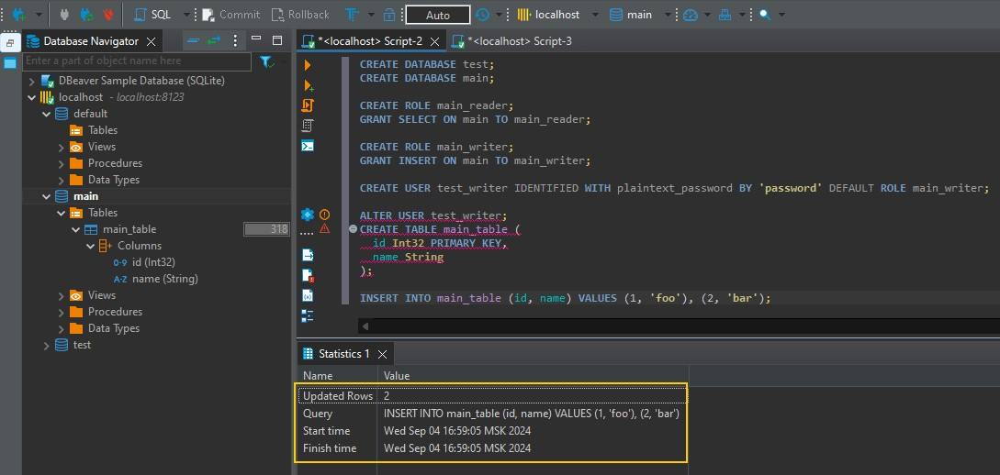
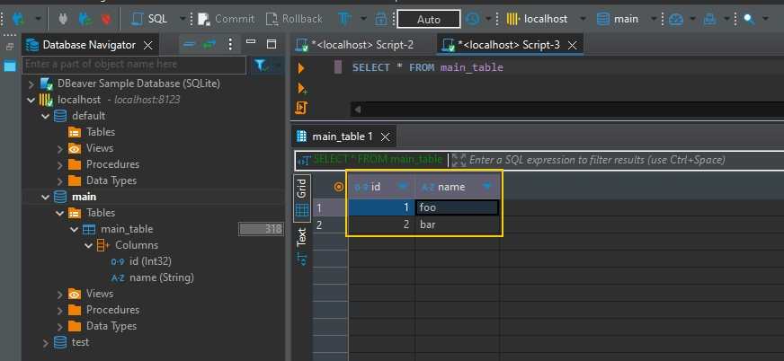

# Итоговая аттестация. Задание 3

Торшин Сергей

## Запуск

1. Загрузить репозиторий
    ```bash
    git clone https://github.com/torshin5ergey/1tdata-do_2024-08-28_6.11-03.git
    ```
2. Перейти в директорию репозитория
    ```bash
    cd 1tdata-do_2024-08-28_6.11-03
    ```
3. Запустить мультиконтейнерное приложение
    ```bash
    docker compose up
    ```

Результат выполнения задания показан на рисунках ниже.


*SQL-скрипт и результат выполнения последнего запроса*


*Данные добавлены в таблицу*